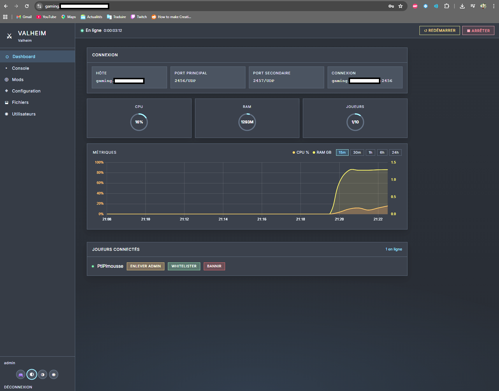
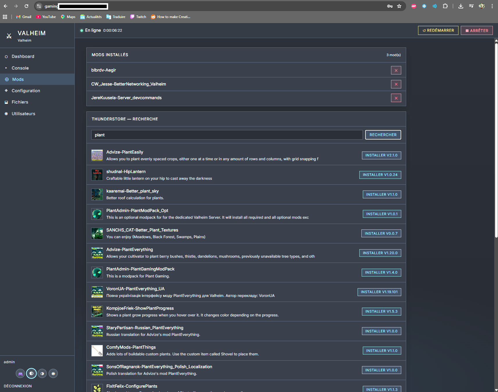
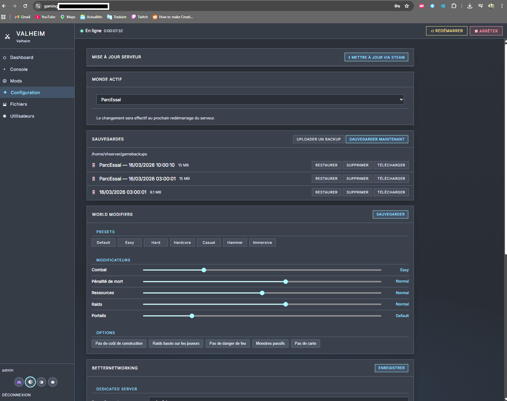
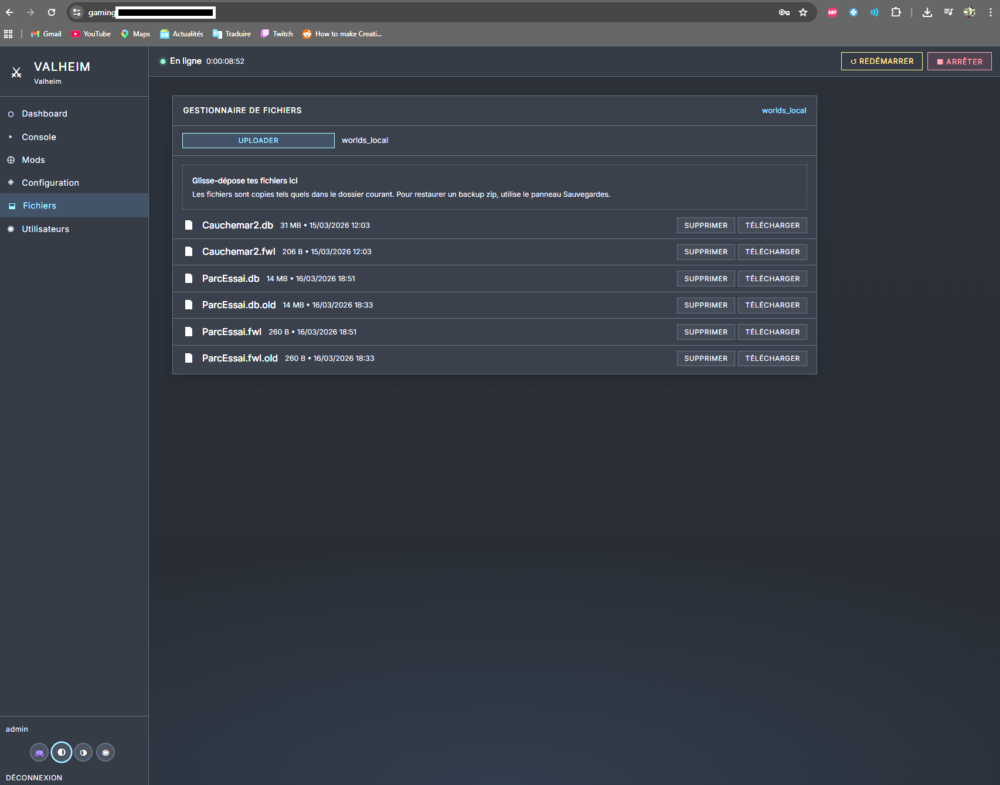
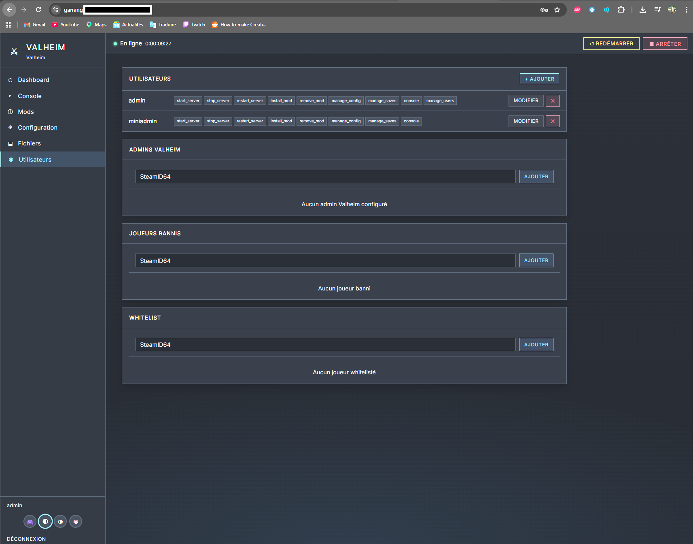

# Game Commander

Suite de déploiement et d’administration de serveurs de jeu,
basée sur `systemd`, `psutil`, `Flask`, `bcrypt` et Nginx.

## Prérequis

- serveur Linux requis
- OS validé en réel : `Ubuntu 24.04`
- `systemd` requis pour le pilotage des services
- `nginx`, `sudo`, `python3` et `apt` requis côté système

Le projet n’est pas prévu pour :
- Windows
- hébergement mutualisé
- environnements sans `systemd`

## Point d'entrée recommandé

L’entrée utilisateur normale est maintenant :

- `https://<domaine>/commander`

Cette page hub liste les instances disponibles et ouvre ensuite leur interface dédiée :

- `https://<domaine>/valheim2`
- `https://<domaine>/testsoul`
- etc.

Les URLs d’instance existent toujours, mais `/commander` est désormais la porte d’entrée
principale.

## Jeux gérés actuellement

- `Valheim`
- `Enshrouded`
- `Minecraft Java`
- `Minecraft Fabric`
- `Terraria` (vanilla)
- `Soulmask`
- `Satisfactory`

Un tableau plus détaillé avec moteur d'installation, mods et fichier de configuration principal
est disponible plus bas dans la section `Jeux supportés`.

## Documentation des menus

Documentation utilisateur disponible pour l'instant :

- [Valheim Commander](docs/valheim-commander.md)

## Valheim Screenshots

### Dashboard


### Mods


### Configuration


### Fichiers


### Utilisateurs


## Utilisation courante

```bash
# Menu interactif
sudo bash game_commander.sh

# Déployer une nouvelle instance complète
sudo bash game_commander.sh deploy

# Attacher Commander à un serveur existant
sudo bash game_commander.sh attach

# Mettre à jour le runtime d'une instance déjà installée
sudo bash game_commander.sh update --instance valheim2

# Voir l'état des instances
sudo bash game_commander.sh status

# Désinstaller
sudo bash game_commander.sh uninstall
```

## Modes de déploiement

- `managed`
  - Game Commander installe et gère aussi le serveur de jeu
  - création du service jeu + du service web Commander

- `attach`
  - Game Commander se branche sur un serveur/service jeu existant
  - ne réinstalle pas le jeu
  - ne recrée pas le service jeu
  - déploie seulement le runtime Commander, son service Flask et l’intégration Nginx

Le mode `attach` est utile pour :

- rattacher Commander à une instance déjà présente
- dissocier l’hébergement du jeu de l’interface Commander
- préparer le support d’installations externes, par exemple hors déploiement Game Commander

## Structure

```
game_commander.sh          ← Point d'entrée deploy/status/uninstall

lib/
  helpers.sh               ← Helpers shell partagés
  nginx.sh                 ← Fonctions Nginx
  cmd_deploy.sh            ← Orchestration du déploiement
  deploy_helpers.sh        ← Helpers de déploiement
  deploy_configure.sh      ← Configuration interactive / validations
  deploy_steps.sh          ← Étapes de déploiement
  cmd_uninstall.sh         ← Orchestration de la désinstallation
  uninstall_gc.sh          ← Désinstallation Game Commander
  uninstall_flask.sh       ← Désinstallation Flask générique
  uninstall_orphans.sh     ← Processus orphelins
  cmd_status.sh            ← Statut instances

tools/
  nginx_manager.py         ← Manifest Nginx + génération des locations
  test_tools.py            ← Tests outils Python

runtime/
  app.py                   ← Flask factory (lit game.json)
  game.json                ← Config active d'une instance déployée
  users.json               ← Utilisateurs (bcrypt)
  metrics.log              ← Métriques append-only
  core/
    auth.py                ← Auth locale + permissions
    server.py              ← psutil + systemd
    metrics.py             ← Poller + lecture
  games/
    valheim/mods.py        ← Thunderstore + BepInEx
    valheim/config.py      ← BetterNetworking.cfg
    enshrouded/config.py   ← enshrouded_server.json
    minecraft/             ← Support Minecraft Java vanilla
    minecraft_fabric/      ← Support Minecraft Fabric + mods Modrinth
    terraria/              ← Support Terraria vanilla
    soulmask/              ← Framework Soulmask vanilla
  templates/
    base/app_base.html     ← Structure commune (Jinja2 blocks)
    base/login_base.html   ← Login commun
    games/valheim/         ← Templates spécifiques Valheim
    games/enshrouded/      ← Templates spécifiques Enshrouded
  static/
    common.css             ← Layout pur (zéro couleur)
    themes/valheim/        ← Thème forge/braise
    themes/enshrouded/     ← Thème brume/sarcelle
```

## Développement runtime

Le runtime Flask peut toujours être lancé seul pour du développement local, mais ce n’est
plus le flux nominal du produit.

En pratique :
- `runtime/game.json` et `runtime/users.json` sont des artefacts d’instance générés par le
  déploiement ou par `update`
- les templates `runtime/game_*.json` servent de base interne au générateur de config
- le développement normal doit donc plutôt partir d’une instance déployée puis d’un
  `update --instance ...` pour propager les changements

Le mode standalone ne doit être utilisé que pour du debug ciblé du runtime.

## `game.json` — Variables clés

| Champ | Rôle |
|---|---|
| `id` | Sélectionne les templates et modules runtime/games/{id}/ |
| `server.binary` | Nom du process pour psutil |
| `server.service` | Nom du service systemd |
| `web.url_prefix` | Préfixe des routes Flask (/valheim, /enshrouded, /terraria, /soulmask) |
| `web.flask_port` | Port d'écoute Flask |
| `features.*` | Active/désactive les onglets (mods, config, console) |
| `theme.name` | Sélectionne runtime/static/themes/{name}/ |

## Ajouter un nouveau jeu

1. Créer `runtime/games/{id}/config.py` et/ou `runtime/games/{id}/mods.py`
2. Créer `runtime/templates/games/{id}/app.html` et `login.html`
3. Créer `runtime/static/themes/{id}/theme.css` et `login.css`
4. Créer `runtime/game_{id}.json`

## Script de déploiement

```bash
# Menu interactif
sudo bash game_commander.sh

# Déploiement interactif d'une nouvelle instance
sudo bash game_commander.sh deploy

# Déploiement avec fichier de config
sudo bash game_commander.sh deploy --config env/deploy_config.env

# Attacher seulement Commander à un service jeu existant
sudo bash game_commander.sh attach

# Variante attach avec fichier de config
sudo bash game_commander.sh deploy --config env/deploy_attach.env

# Générer un modèle de config
sudo bash game_commander.sh deploy --generate-config

# Désinstallation / statut / update
sudo bash game_commander.sh uninstall
sudo bash game_commander.sh status
sudo bash game_commander.sh update --instance testfabric
```

### Ce que fait le script (12 étapes)

| Étape | Action |
|---|---|
| 0 | Vérification root |
| 1 | Détection OS |
| 2 | Configuration interactive (ou depuis fichier) |
| 3 | Dépendances apt + pip + SteamCMD |
| 4 | Installation serveur de jeu via SteamCMD |
| 5 | Service systemd du serveur de jeu |
| 6 | Sauvegardes automatiques (cron 3h, 7 jours) |
| 7 | Copie Game Commander + génération game.json + users.json |
| 8 | Service systemd Flask |
| 9 | Nginx (manifest + fichier locations généré + include dans le vhost) |
| 10 | SSL (certbot / existing / none) |
| 11 | Règles sudoers (systemctl + BepInEx pour Valheim) |
| 12 | Sauvegarde deploy_config.env |

Comportement important du mode `attach` :
- `GAME_SERVICE` est conservé tel que fourni
- `SERVER_DIR` et `DATA_DIR` sont conservés tels que fournis
- les ports du serveur existant ne sont pas auto-décalés
- seul le port Flask de la nouvelle UI Commander peut être ajusté si déjà utilisé

### Nginx multi-instances

Le déploiement actuel ne maintient plus chaque bloc `location` directement dans le vhost
partagé. Il utilise :

- `/etc/nginx/game-commander-manifest.json` comme source de vérité des instances
- `/etc/nginx/game-commander-locations.conf` comme fichier auto-généré
- `/etc/nginx/game-commander-hub.html` comme page hub auto-générée
- `tools/nginx_manager.py` pour initialiser, migrer, régénérer et nettoyer

Le vhost du domaine inclut ensuite ce fichier généré dans son bloc SSL et expose aussi
`/commander` comme hub de navigation entre instances.

## GitHub

Le dépôt local est prévu pour être synchronisé avec GitHub via `origin`.

Avant push, lancer :

```bash
./tools/github_preflight.sh
```

Ce script :
- vérifie que `origin` existe
- vérifie que les fichiers serveur sensibles ne sont pas trackés
- exécute `./tools/test_modularization.sh`

Un hook `pre-push` versionné est aussi fourni dans `.githooks/pre-push`.

## État de la modularisation

La modularisation bash est en place :

- `game_commander.sh` est un point d'entrée léger
- le déploiement est séparé entre orchestration, configuration et étapes
- la désinstallation est séparée entre orchestration, instances Game Commander,
  applis Flask génériques et processus orphelins
- une commande `update` permet de resynchroniser le runtime d'une instance déjà installée
  sans réinstaller le serveur de jeu
- `update` préserve aussi un `GAME_SERVICE` personnalisé, nécessaire pour les instances
  déployées en mode `attach`
- la gestion Nginx moderne est centralisée via `tools/nginx_manager.py`

## Documentation de contexte

La documentation de contexte du projet repose désormais sur :

- `Contexte/CODEX.md` pour le contexte opérationnel concis
- `Contexte/CODEX_historique.md` pour la mémoire projet détaillée
- `Contexte/BUGS.md` pour les régressions, bugs connus et solutions validées
- `README.md` pour la vue d'ensemble du dépôt
- `Contexte/GUIDE_DEMARRAGE.md` pour une prise en main débutant côté serveur/VPS/SSH
- `env/ENV.md` pour l'organisation des fichiers `.env` locaux

### Jeux supportés

| Jeu | Steam | BepInEx | Config |
|---|---|---|---|
| Valheim | ✅ 896660 | ✅ optionnel | BetterNetworking.cfg |
| Enshrouded | ✅ 2278520 | — | enshrouded_server.json |
| Minecraft Java | ✅ vanilla | — | `server.properties` |
| Minecraft Fabric | ✅ Fabric | ✅ Modrinth | `server.properties` |
| Terraria | ✅ serveur officiel | — | `serverconfig.txt` |
| Soulmask | ✅ 3017300 | — | `soulmask_server.json` |
| Satisfactory | ✅ 1690800 | — | API HTTPS native |

Note Hub Admin :
- `/commander` est désormais une interface d'administration hôte distincte des Commanders d'instance
- authentification séparée
- vue globale des instances
- premières actions d'exploitation disponibles :
  - `start / stop / restart`
  - `update` d'une instance
  - `rebalance` CPU

Note Minecraft Java :
- le serveur téléchargé automatiquement peut être plus récent que ton client Java local
- en cas d'erreur `Incompatible client`, il faut lancer la bonne version dans le launcher
- les sauvegardes ciblent `world/` et les fichiers admin utiles (`server.properties`, `ops.json`, `whitelist.json`, `banned-players.json`, `banned-ips.json`, `usercache.json`)

Note Minecraft Fabric :
- un client Java vanilla peut se connecter tant qu'aucun mod serveur n'exige un client moddé
- l'installation de mods passe par Modrinth
- les dépendances Fabric requises sont résolues automatiquement, y compris quand elles ne sont pas complètement déclarées dans l'API Modrinth mais présentes dans `fabric.mod.json`
- les sauvegardes ciblent `world/` et les mêmes fichiers admin utiles que Minecraft Java, sans inclure `mods/`, `libraries/` ou les binaires serveur

Note Terraria :
- le support actuel cible le serveur dédié vanilla officiel Linux
- la configuration exposée dans l'UI repose sur `serverconfig.txt`
- le premier lot couvre déploiement, service systemd, sauvegardes et configuration, sans mods/tModLoader
- le lancement réel s'appuie sur un `start_server.sh` qui passe les paramètres critiques du monde en ligne de commande au binaire Terraria, en plus de `serverconfig.txt`
- le service Terraria utilise aussi un wrapper PTY (`script -qefc`) pour éviter une charge CPU anormalement élevée en mode headless sans terminal
- validé en réel pour l'installation, la création/charge du monde, le service et l'UI Game Commander

Note Soulmask :
- le support Soulmask vanilla est maintenant implémenté et validé partiellement en déploiement réel
- le support gère un groupe de ports complet :
  - port jeu UDP
  - query port UDP
  - echo port TCP
- le lot actuel couvre l'installation SteamCMD, le service systemd, les sauvegardes, la config UI et la validation des groupes de ports
- un bug de launcher a été corrigé : le wrapper Game Commander appelle maintenant `WSServer.sh` avec un jeu d'arguments propre, au lieu d'empiler des flags dupliqués sur `StartServer.sh`
- la charge CPU au repos reste à surveiller plus tard en condition réelle avec joueur connecté
- en validation réelle, Soulmask a aussi montré des phases de démarrage et d'arrêt sensiblement plus lentes que les autres jeux déjà supportés ; il faut laisser quelques minutes avant de juger la charge CPU juste après un `start` ou `restart`

Note Satisfactory :
- le support actuel couvre maintenant :
  - déploiement
  - service systemd
  - console/fichiers/sauvegardes
  - claim du serveur
  - changement du mot de passe admin
  - définition/suppression du mot de passe joueur
  - renommage du serveur
- la connexion dépend du port jeu et du `ReliablePort`
- le Commander affiche l'état du claim et peut relire les infos serveur via le mot de passe admin actuel

### Politique actuelle de sauvegarde

- Valheim
  - sauvegarde le monde serveur (`worlds_local/` ou `worlds/`)
  - cible surtout les fichiers du monde (`.db`, `.fwl`, `.old`)
  - les personnages restent en pratique côté client

- Enshrouded
  - sauvegarde `savegame/`

- Minecraft Java
  - sauvegarde `world/`
  - inclut aussi `server.properties`, `ops.json`, `whitelist.json`, `banned-players.json`, `banned-ips.json`, `usercache.json`

- Minecraft Fabric
  - même politique que Minecraft Java
  - sans inclure `mods/`, `libraries/`, `logs/` ni les binaires

- Terraria
  - sauvegarde le dossier de monde/données du serveur
  - les personnages restent en pratique côté client

- Soulmask
  - sauvegarde `WS/Saved`
