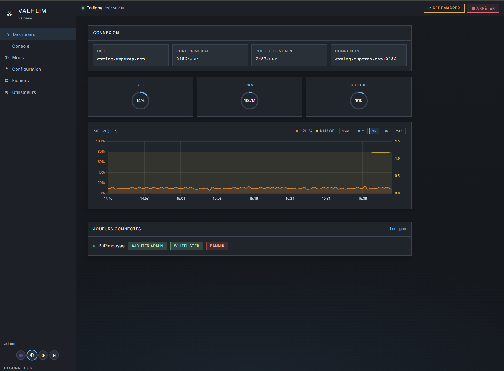
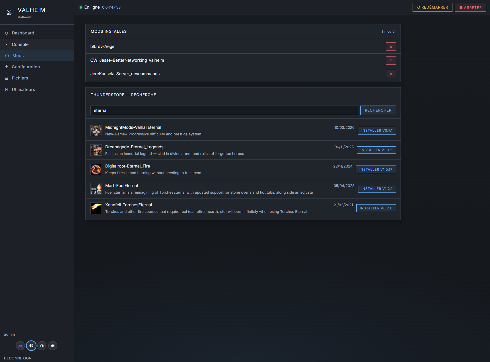
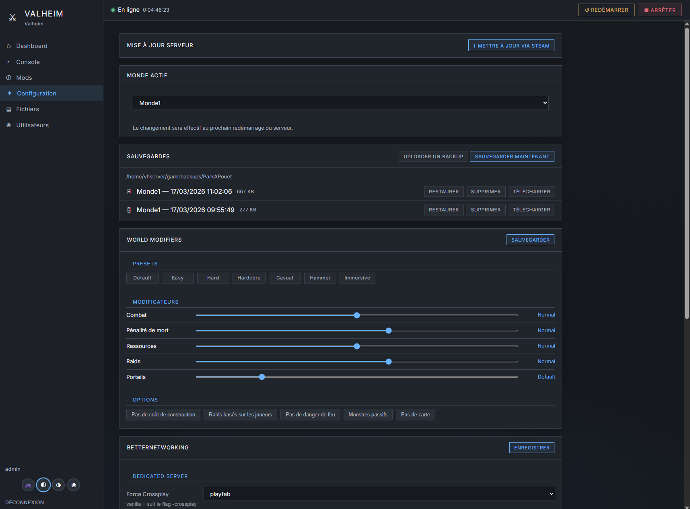

# Game Commander

Suite d'administration de serveurs de jeux dédiés sur Linux.
Un **Hub Admin** central (`/commander`) pilote toutes les instances, chacune disposant de sa propre interface web Flask avec thème par jeu.

---

## Fonctionnalités

**Hub Admin (`/commander`)**
- Vue globale de toutes les instances (état, CPU, RAM, joueurs)
- Déployer / redéployer / désinstaller une instance depuis l'interface
- Start / stop / restart / update par instance
- Rebalance CPU avec ou sans restart
- Console globale des actions hôte (logs en temps réel)
- Intégration Discord : canaux par instance, droits par utilisateur ou rôle

**Commander par instance**
- Dashboard : état, métriques CPU/RAM/joueurs, console
- Gestion des mods (Valheim via Thunderstore/BepInEx, Fabric via Modrinth)
- Configuration serveur éditable depuis l'UI
- Gestionnaire de fichiers et de sauvegardes
- Sauvegardes automatiques (cron toutes les 3h, rétention 7 jours)
- Actions joueurs : admin, whitelist, ban

**Déploiement**
- Installation complète en une commande (SteamCMD + systemd + Nginx + SSL)
- Mode `attach` pour brancher l'UI sur un service jeu existant
- Déploiement non interactif via fichier de config ou depuis le Hub
- Mise à jour du runtime sans réinstaller le jeu (`update --instance`)

---

## Jeux supportés

| Jeu | Mods | Config principale |
|---|---|---|
| Valheim | BepInEx + Thunderstore | `BetterNetworking.cfg` |
| Enshrouded | — | `enshrouded_server.json` |
| Minecraft Java | — | `server.properties` |
| Minecraft Fabric | Modrinth (résolution auto des dépendances) | `server.properties` |
| Terraria | — | `serverconfig.txt` |
| Soulmask | — | `soulmask_server.json` |
| Satisfactory | — | API HTTPS native |

---

## Screenshots

### Valheim Commander — Dashboard


### Valheim Commander — Mods


### Valheim Commander — Configuration


---

## Démarrage rapide

### Installer le Hub sur un serveur Ubuntu vierge

```bash
curl -fsSL https://raw.githubusercontent.com/Bakatora000/game_commander/main/install_hub.sh | \
  sudo GC_DOMAIN=gaming.example.com bash
```

Le Hub Admin est ensuite accessible à `https://gaming.example.com/commander`.

Alternative une fois le dépôt présent localement :

```bash
sudo bash game_commander.sh bootstrap-hub --domain gaming.example.com
```

### Déployer une instance de jeu

```bash
# Interactif (guidé)
sudo bash game_commander.sh deploy

# Depuis un fichier de config
sudo bash game_commander.sh deploy --config env/deploy_config.env

# Depuis le Hub : onglet Dashboard → bouton Déployer
```

### Autres commandes

```bash
sudo bash game_commander.sh update --instance valheim2   # mise à jour runtime
sudo bash game_commander.sh status                       # état de toutes les instances
sudo bash game_commander.sh uninstall                    # désinstallation guidée
sudo bash game_commander.sh attach                       # brancher sur un service existant
```

---

## Prérequis

- Linux avec `systemd` (validé sur Ubuntu 24.04)
- `nginx`, `python3`, `sudo`, `apt`
- Non prévu pour Windows, hébergement mutualisé, ou environnements sans `systemd`

---

## Intégration Discord (optionnelle)

Le Hub peut créer automatiquement un canal Discord par instance et envoyer des notifications pour chaque action hôte.

**Configuration minimale** — `/etc/game-commander/discord.json` :
```json
{
  "bot_token": "votre-bot-token",
  "guild_id": "identifiant-du-serveur-discord",
  "enabled": true
}
```

**Permissions bot requises** : `Manage Channels`, `Send Messages`, `View Channels`

**Fonctionnement automatique** :
- À chaque déploiement, une catégorie Discord par jeu est créée si absente (`valheim`, `enshrouded`…), puis le canal de l'instance est créé à l'intérieur
- Les actions `start / stop / restart / update / deploy / uninstall / rebalance` notifient le canal de l'instance concernée

**Gestion depuis le Hub** (`/commander` → onglet Discord) :
- Guild ID et Category ID configurables depuis l'interface
- Création et suppression manuelle de canal par instance
- Droits lecture seule par utilisateur ou rôle Discord

---

## Étapes du déploiement

| Étape | Action |
|---|---|
| 0 | Vérification root |
| 1 | Détection OS |
| 2 | Configuration interactive (ou depuis fichier) |
| 3 | Dépendances `apt` + `pip` + SteamCMD |
| 4 | Installation serveur de jeu via SteamCMD |
| 5 | Service systemd du serveur de jeu |
| 6 | Sauvegardes automatiques |
| 7 | Copie Game Commander + génération `game.json` + `users.json` |
| 8 | Service systemd Flask (Commander) |
| 8B | Synchronisation Hub Admin |
| 9 | Nginx (manifest + locations générées) |
| 10 | SSL (certbot / existant / aucun) |
| 11 | Règles sudoers |
| 11B | Sauvegarde `deploy_config.env` |
| 12 | Création canal Discord (si `guild_id` configuré) |

---

## Structure du projet

```
game_commander.sh          ← Point d'entrée

lib/
  cmd_deploy.sh            ← Orchestration déploiement
  deploy_steps.sh          ← Étapes 3 à 12
  deploy_helpers.sh        ← Defaults, config file, logging
  deploy_configure.sh      ← Configuration interactive
  cmd_uninstall.sh         ← Orchestration désinstallation
  cmd_update.sh            ← Mise à jour runtime instance
  cmd_status.sh            ← Statut instances
  helpers.sh / nginx.sh    ← Helpers shell partagés

shared/
  discordnotify.py         ← Notifications et gestion canaux Discord
  hubsync.py               ← Synchronisation Hub Admin
  deploycore.py            ← Déploiement piloté depuis le Hub
  uninstallcore.py         ← Désinstallation pilotée depuis le Hub
  instanceenv.py           ← Lecture des configs d'instance

tools/
  nginx_manager.py         ← Manifest Nginx + génération locations
  host_cli.py              ← CLI pour actions hôte depuis Hub
  test_tools.py            ← Tests Python

runtime/                   ← Runtime Flask par instance (copié au déploiement)
  app.py                   ← Factory Flask
  core/auth.py             ← Auth bcrypt + permissions
  core/server.py           ← psutil + systemd
  core/metrics.py          ← Métriques CPU/RAM/joueurs
  games/valheim/           ← Mods, config, joueurs Valheim
  games/enshrouded/        ← Config Enshrouded
  games/minecraft*/        ← Vanilla + Fabric + Modrinth
  games/terraria/          ← Config, joueurs, bans Terraria
  games/soulmask/          ← Config Soulmask
  games/satisfactory/      ← API native Satisfactory

runtime_hub/               ← Flask Hub Admin (/commander)
  app.py                   ← Routes Hub
  core/host.py             ← Actions hôte + Discord
  core/auth.py             ← Auth Hub séparée
  templates/app.html       ← Interface Hub
```

---

## Politique de sauvegarde

| Jeu | Cible |
|---|---|
| Valheim | Fichiers monde (`.db`, `.fwl`, `.old`) |
| Enshrouded | `savegame/` |
| Minecraft Java | `world/` + fichiers admin |
| Minecraft Fabric | `world/` + fichiers admin (sans `mods/`, `libraries/`) |
| Terraria | Dossier monde/données serveur |
| Soulmask | `WS/Saved` |
| Satisfactory | `SaveGames/` |

---

## Ajouter un nouveau jeu

1. `runtime/games/{id}/config.py` et/ou `mods.py`
2. `runtime/templates/games/{id}/app.html` et `login.html`
3. `runtime/static/themes/{id}/theme.css` et `login.css`
4. `runtime/game_{id}.json`

---

## Documentation

| Fichier | Contenu |
|---|---|
| `Contexte/CODEX.md` | Contexte opérationnel et notes d'architecture |
| `Contexte/BUGS.md` | Bugs résolus, régressions connues, solutions validées |
| `Contexte/GUIDE_DEMARRAGE.md` | Prise en main débutant (VPS, SSH, Linux) |
| `docs/valheim-commander.md` | Documentation utilisateur Valheim |
| `env/ENV.md` | Organisation des fichiers `.env` locaux |
